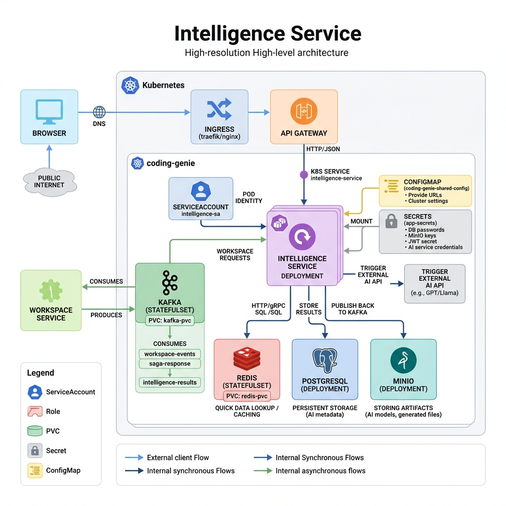

# 🧠 Intelligence Service

> AI Orchestration Engine for Coding Genie — responsible for processing workspace generation requests, interacting with AI models, managing AI artifacts, and publishing generated results back to the platform.



---

# 📖 Overview

The Intelligence Service is the brain of the Coding Genie platform.

It acts as an asynchronous AI processing engine that:

- Consumes workspace generation requests from Kafka.
- Invokes external AI providers (GPT, Llama, Claude, etc.).
- Generates project code and AI artifacts.
- Stores generated content and metadata.
- Publishes generation results back to the platform.
- Coordinates with Workspace Service through event-driven communication.

The service follows an event-driven architecture and is designed to scale independently from the rest of the platform.

---

# 🎯 Responsibilities

### AI Request Processing
- Consume workspace generation requests.
- Generate source code from prompts.
- Modify existing projects.
- Process AI-assisted edits.

### AI Integration
- OpenAI
- GPT Models
- Llama Models
- Future AI Providers

### Artifact Management
- Store generated projects.
- Store generated assets.
- Store AI metadata.

### Event Publishing
- Publish generation results.
- Notify downstream services.
- Participate in Saga workflows.

---

# 🏗️ High-Level Architecture

```text
Browser
   |
   v
API Gateway
   |
   v
Workspace Service
   |
   v
Kafka (workspace-events)
   |
   v
Intelligence Service
   |
   +------------------------+
   |                        |
   v                        v

External AI API        Redis Cache

   |
   v

Generated Project
   |
   +------------+
   |            |
   v            v

PostgreSQL    MinIO
   |
   v

Kafka (intelligence-results)
   |
   v

Workspace Service
```

---

# 🚀 Request Processing Flow

## Step 1 – Workspace Creation

User creates a new project from the frontend.

```text
Frontend
   |
   v
API Gateway
   |
   v
Workspace Service
```

Workspace Service persists workspace information and emits an event.

---

## Step 2 – Publish Kafka Event

Workspace Service publishes a message to:

```text
workspace-events
```

Topic containing:

```json
{
  "workspaceId": "123",
  "userPrompt": "Build a Todo Application",
  "techStack": "React + Spring Boot"
}
```

---

## Step 3 – Consume Event

Intelligence Service subscribes to:

```text
workspace-events
```

and receives the generation request.

```text
Kafka
   |
   v
Intelligence Service
```

---

## Step 4 – Retrieve Context

Before calling the AI provider, the service gathers:

- Workspace information
- Existing project context
- User preferences
- Previous AI generations

from:

```text
Redis
PostgreSQL
MinIO
```

---

## Step 5 – Construct Prompt

The service builds a system prompt.

Example:

```text
Generate a production-grade Todo Application
using React, TypeScript and Spring Boot.
```

Additional context may include:

- Existing source code
- Previous conversations
- Generated files
- Workspace metadata

---

## Step 6 – Invoke External AI

The service invokes an AI provider.

```text
Intelligence Service
        |
        v
OpenAI / GPT
```

or

```text
Intelligence Service
        |
        v
Llama
```

The provider generates:

- Source Code
- Project Structure
- Configuration Files
- Documentation

---

## Step 7 – Process Response

The generated response is parsed into:

```text
Project
 ├── frontend
 ├── backend
 ├── docker
 └── configuration
```

Internal validation and transformation are applied.

---

## Step 8 – Persist Results

### Redis

Stores:

- Fast lookup data
- Generation status
- Temporary cache

```text
workspaceId -> GENERATING
workspaceId -> COMPLETED
```

---

### PostgreSQL

Stores:

- AI metadata
- Request history
- Generation logs
- Workspace mappings

---

### MinIO

Stores:

- Generated source code
- ZIP files
- Assets
- Build artifacts

```text
bucket/
 └── workspace-123/
       ├── frontend/
       ├── backend/
       └── docs/
```

---

## Step 9 – Publish Result Event

After successful generation:

```text
Intelligence Service
       |
       v
Kafka
       |
       v
intelligence-results
```

Example:

```json
{
  "workspaceId": "123",
  "status": "COMPLETED",
  "artifactLocation": "minio://workspace-123"
}
```

---

## Step 10 – Workspace Service Updates Status

Workspace Service consumes:

```text
intelligence-results
```

and updates:

```text
GENERATING
     ↓
READY
```

---

# 📦 Kafka Communication

## Consumed Topics

### workspace-events

Purpose:

```text
Workspace creation requests
AI generation requests
Project modification requests
```

---

## Produced Topics

### intelligence-results

Purpose:

```text
Generation completed
Generation failed
Artifact available
```

---

### saga-response

Purpose:

```text
Distributed transaction coordination
Compensation events
Cross-service workflows
```

---

# 💾 Storage Architecture

## Redis

Purpose:

- Caching
- Generation status
- Fast lookups

Example:

```text
workspace:123 -> READY
```

---

## PostgreSQL

Purpose:

- AI metadata
- Audit logs
- Generation history
- Request tracking

---

## MinIO

Purpose:

- Generated projects
- Source code archives
- Assets
- AI artifacts

---

# 🔐 Security Architecture

## Service Account

```text
intelligence-sa
```

Provides:

- Kubernetes identity
- Pod authentication
- Least privilege access

---

## ConfigMap

Provides:

- Service URLs
- Environment settings
- Cluster configuration

---

## Secrets

Stores:

- Database credentials
- JWT secret
- MinIO credentials
- AI Provider API Keys

---

# ⚙️ Deployment Architecture

```text
Deployment
   |
   v
Replica Set
   |
   v
Intelligence Service Pods
```

Can scale horizontally.

```text
1 Pod
5 Pods
20 Pods
```

depending on AI workload.

---

# 🌐 Infrastructure Dependencies

| Component | Purpose |
|------------|----------|
| API Gateway | Entry Point |
| Workspace Service | Request Producer |
| Kafka | Event Streaming |
| Redis | Cache |
| PostgreSQL | Metadata Storage |
| MinIO | Artifact Storage |
| External AI APIs | Code Generation |
| Kubernetes | Container Orchestration |

---

# 📈 End-to-End Generation Sequence

```text
User
 |
Frontend
 |
API Gateway
 |
Workspace Service
 |
Kafka (workspace-events)
 |
Intelligence Service
 |
External AI Provider
 |
Store Results
 |----> Redis
 |----> PostgreSQL
 |----> MinIO
 |
Kafka (intelligence-results)
 |
Workspace Service
 |
Frontend
 |
User receives generated project
```

---

# 🎯 Design Principles

- Event-Driven Architecture
- Horizontal Scalability
- Fault Tolerance
- Asynchronous Processing
- AI Provider Agnostic
- Cloud Native Deployment
- Kubernetes First Design
- Distributed System Friendly

---

# 👨‍💻 Part of Coding Genie Platform

The Intelligence Service serves as the AI execution layer of Coding Genie and is responsible for transforming user intent into working software through scalable, event-driven AI workflows.
